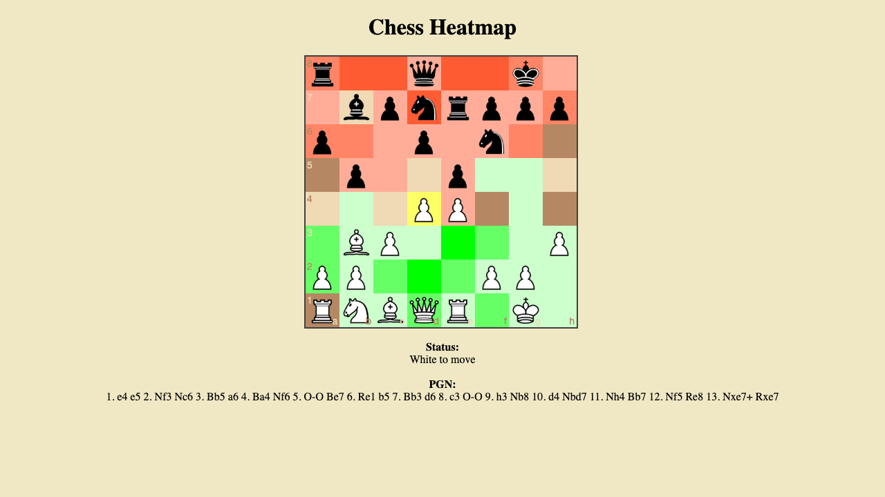

# Chess Heatmap

An interactive chessboard that visualizes square control as a heatmap. Green squares are controlled by white, red by black, and yellow marks pieces in tension (equally attacked by both sides). Deeper colors mean stronger control.

**[Play it here](https://cogan.github.io/chessheatmap/)**

## How It Works

Play a normal game of chess by dragging pieces. After each move, the board repaints to show which squares each side controls. The heatmap factors in attacks, defenses, and piece coverage — so you can see at a glance where each side is strong or weak.

The heatmap also updates live as you drag a piece, previewing how the board control would change before you commit the move.

## Built With

JavaScript, [chess.js](https://github.com/jhlywa/chess.js), and [chessboard.js](https://chessboardjs.com/). Hosted on GitHub Pages.
